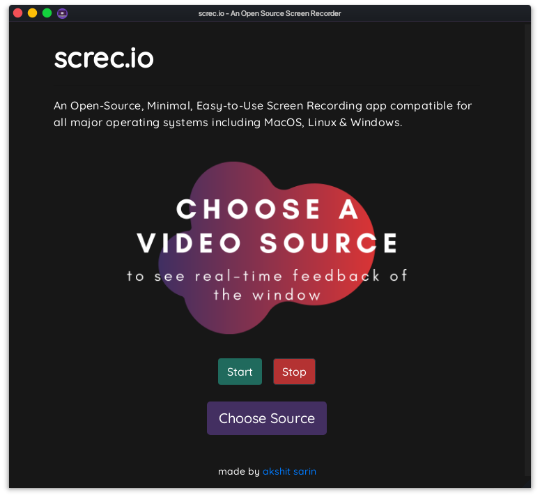

# screc.io

 
**screc.io** is an Open Source, Minimal, Easy-to-use screen-recording app made in Electron, &amp; works pretty much on all major operating systems (MacOS, Linux, Windows). 

---

## How To Use :  
- Simply click on the <strong>'Choose Source'</strong> button to select a video source.  
> As soon as a video source is selected, a **real-time feedback** of the selected source is shown inside the screc.io window.  

- Clicking on <strong>'Start'</strong> starts recording the selected source window and the status of start button changes to <strong>'Recording'</strong>.  
- Clicking on <strong>'Stop'</strong> opens a <strong>Save File</strong> popup to save the recorded video to local storage.

---

`screc` : **sc**reen + **rec**order | `.io`   : looks cool i guess :p
